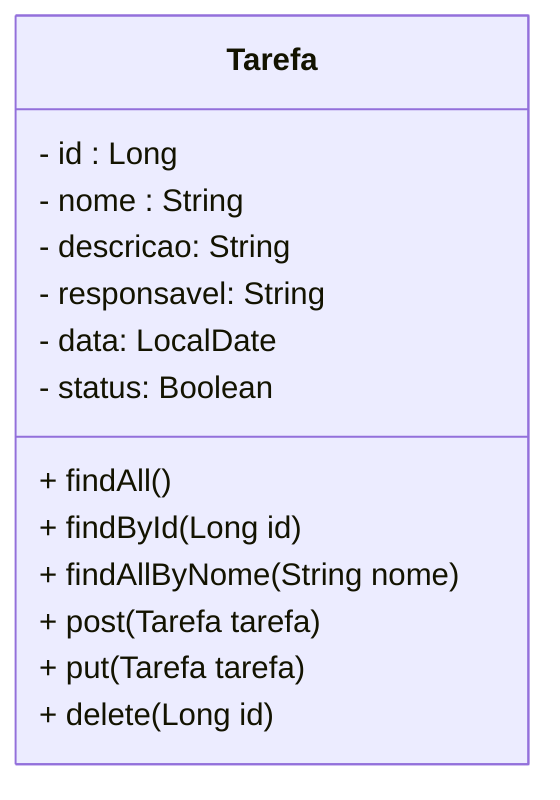

# Projeto Todo-List - TDD com Spring

 

     

  

## Diagrama de Classes

```mermaid
classDiagram
class Tarefa {
  - id : Long
  - nome : String
  - descricao: String
  - responsavel: String
  - data: LocalDate
  - status: Boolean
  + findAll()
  + findById(Long id)
  + findAllByNome(String nome)
  + post(Tarefa tarefa)
  + put(Tarefa tarefa)
  + delete(Long id)
}
```
  

